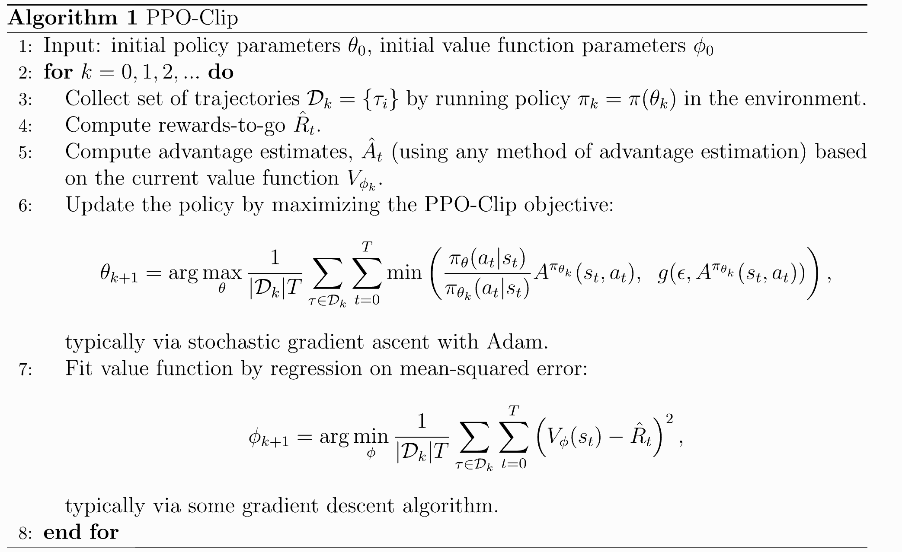

# PPO

writing out [spinning up article on PPO](https://spinningup.openai.com/en/latest/algorithms/ppo.html) to understand it

- extension of TRPO. i don't even know what TRPO is. 
- model-free
- on-policy

There are two variants: PPO-Clip and PPO-penalty but PPO-clip is the one used mainly. 

Math behind the algo:
The main parameter updating equation SGD works with:

$$\theta_{k+1} = \argmax_{\theta} \mathbb{E}_{s,a \sim \pi_{\theta_k}} \left[ L(s,a,\theta_k,\theta) \right].$$

$L(s,a,\theta_k,\theta)$ is a reward function for a set of parameters $\theta$ that the algorithm wants to maximize. 
The actual definition of $L$ is ugly:
$$L(s,a,\theta_k,\theta) = \min \left( \frac{\pi_{\theta}(a,s)}{\pi_{\theta_k}(a,s)} A^{\pi_{\theta_k}}(s,a), g(\epsilon,A^{\pi_{\theta_k}}(s,a)) \right)$$
$$
g(\epsilon, A) =
\begin{cases} 
(1 + \epsilon)A & A \geq 0, \\
(1 - \epsilon)A & A < 0.
\end{cases}
$$
where $\epsilon$ is a hyperparameter representing how much we allow the policy to deviate on each update. 

This is just a readable equation, but we can consider when the advantage positive or negative to more easily understand it:

## Advantage function is positive (good action!!) (technically it's non-negative):
Intuitively, when the advantage function is positive the action is relatively good and we want to encourage it -> big $L$.
$$L(s,a,\theta_k,\theta) = \min \left( \frac{\pi_{\theta}(a,s)}{\pi_{\theta_k}(a,s)}, (1+\epsilon) \right) A^{\pi_{\theta_k}}(s,a)$$
The fraction term means how much more likely we are to select this pair in a new policy compared to the current policy.
Normally, $L$ would increase linearly with how much more likely we are to select the given pair, but the $\min$ caps it at $1 + \epsilon$.
The model isn't incentivized to get the probability higher than $1+\epsilon$ since it doesn't do anything.
This is the main point of PPO: violent updates are scary and bad so this makes sure the limitation makes training goes slow and steady.

## Advantage function is negative (action bad):

$$L(s,a,\theta_k,\theta) = \max \left( \frac{\pi_{\theta}(a,s)}{\pi_{\theta_k}(a,s)}, (1-\epsilon) \right) A^{\pi_{\theta_k}}(s,a)$$

The parameters want to make this pair less likely -> negative $L$ since $A$ is negative.
The idea is basically the same but in the other direction.
The model isn't incentivized to make the probablity ratio lower than $1-\epsilon$ since it doesn't do anything.
Updates are "limited" in magnitude by $\epsilon$. 

## Pseudocode

## Other
- value function has to update along with the policy parameters
